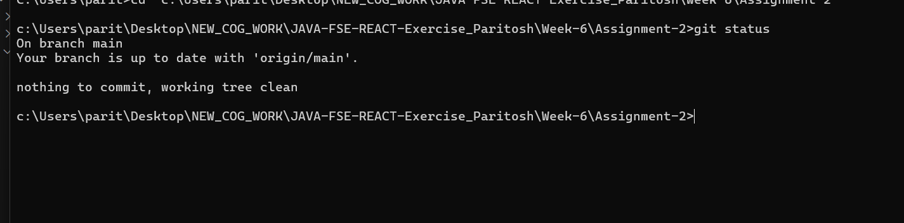

# Assignment 2 - Git Ignore

## Objectives
- Explain git ignore
- Explain how to ignore unwanted files using git ignore
- Implement git ignore command to ignore unwanted files and folders

## What is `.gitignore`?
The `.gitignore` file is a text file that tells Git which files or folders to ignore in a project. Usually, you use it to ignore temporary files, build artifacts (like `node_modules` or `.class` files), and sensitive information (like passwords or API keys) so they are not tracked or pushed to a remote repository.

## Steps Executed to Ignore Files

**1. Create a log file and a log folder**
First, we create a `.log` file and a `log` directory in the repository:
```bash
mkdir log
touch app.log
touch log/server.log
```

**2. Check Git Status (Before Ignoring)**
If you run `git status` right now, Git will show these files as "untracked":
```bash
git status
```
*(Output will show `app.log` and the `log/` folder as untracked)*

**3. Create and Update the `.gitignore` File**
We create a file named `.gitignore` and add rules to ignore all `.log` files and the entire `log` folder:
```bash
echo "*.log" > .gitignore
echo "log/" >> .gitignore
```
*Note: `*.log` tells Git to ignore any file ending in `.log` anywhere in the project, and `log/` tells Git to ignore the specific directory named `log`.*

**4. Verify Git Status (After Ignoring)**
Now, we verify that Git is correctly ignoring those files:
```bash
git status
```
*(Output will now ONLY show the `.gitignore` file as untracked. The `app.log` and `log/` directory will no longer appear, proving they are successfully ignored!)*

**5. Commit the `.gitignore` File**
Finally, we commit the `.gitignore` file to the repository so the rules are saved:
```bash
git add .gitignore
git commit -m "Add gitignore to ignore log files and folders"
git push
```

## Final Output

*(Below is the screenshot showing the final successful `git status` where log files are ignored)*


*(Note: Please capture a screenshot of your terminal after step 4, name it `final_output_screenshot.png`, and place it in this folder if you'd like it to appear here).*
