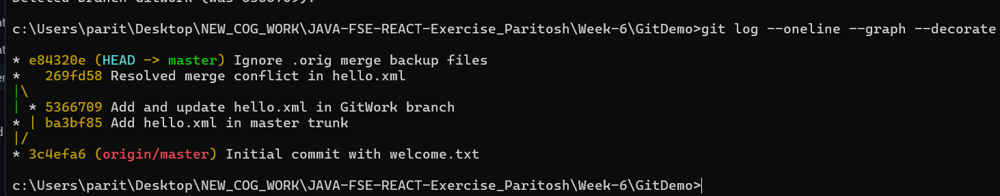

# Assignment 4 - Resolving Merge Conflicts

## Instructions & Commands

**1. Verify if master is in a clean state.**
```bash
git status
```

**2. Create a branch “GitWork”. Add a file “hello.xml”.**
```bash
git branch GitWork
git checkout GitWork
echo "<message>Hello from branch</message>" > hello.xml
git add hello.xml
```

**3. Update the content of “hello.xml” and observe the status**
*(You can update the file using any text editor. Or just run the following)*
```bash
echo "<message>Updated Hello from branch</message>" > hello.xml
git status
```

**4. Commit the changes to reflect in the branch**
```bash
git add hello.xml
git commit -m "Add and update hello.xml in GitWork branch"
```

**5. Switch to master.**
```bash
git checkout master
```

**6. Add a file “hello.xml” to the master and add some different content than previous.**
```bash
echo "<message>Hello from master trunk</message>" > hello.xml
git add hello.xml
```

**7. Commit the changes to the master**
```bash
git commit -m "Add hello.xml in master trunk"
```

**8. Observe the log by executing “git log --oneline --graph --decorate --all”**
```bash
git log --oneline --graph --decorate --all
```

**9. Check the differences with Git diff tool**
```bash
git diff master..GitWork
```

**10. For better visualization, use P4Merge tool to list out all the differences between master and branch**
*(Ensure P4Merge is configured as your difftool)*
```bash
git difftool master..GitWork
```

**11. Merge the branch to the master**
```bash
git merge GitWork
```
*(This will cause a Merge Conflict since `hello.xml` was modified differently on both branches).*

**12. Observe the git mark up.**
```bash
cat hello.xml
```
*(You will see `<<<<<<< HEAD`, `=======`, and `>>>>>>> GitWork` inside the file).*

**13. Use 3-way merge tool to resolve the conflict**
*(Ensure P4Merge is configured as your mergetool)*
```bash
git mergetool
```
*(Resolve the conflict visually in P4Merge, save, and exit).*

**14. Commit the changes to the master, once done with conflict**
```bash
git commit -m "Resolve merge conflict in hello.xml"
```

**15. Observe the git status and add backup file to the .gitignore file.**
*(Most mergetools create a `.orig` backup file after merging).*
```bash
git status
echo "*.orig" >> .gitignore
```

**16. Commit the changes to the .gitignore**
```bash
git add .gitignore
git commit -m "Ignore .orig merge backup files"
```

**17. List out all the available branches**
```bash
git branch -a
```

**18. Delete the branch, which merged to master.**
```bash
git branch -d GitWork
```

**19. Observe the log by executing “git log --oneline --graph --decorate”**
```bash
git log --oneline --graph --decorate
```

## Final Output

*(Below is the screenshot showing the successful merge and the commit history graph)*

 
*(Note: Please place your attached screenshot in this folder and name it `final_output_screenshot.png` to display it here).*
