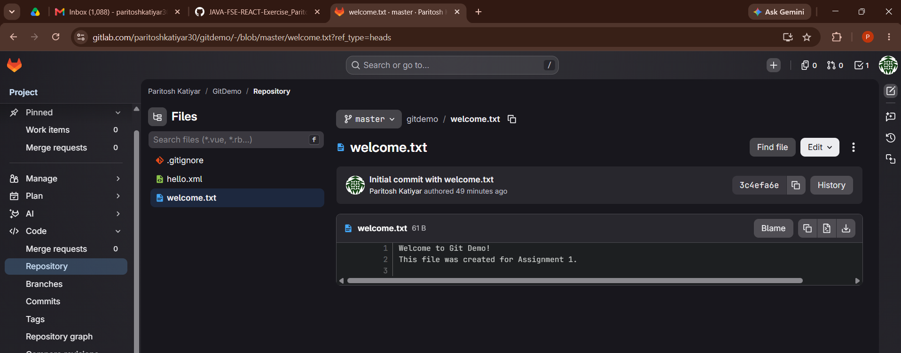

# Assignment 5 - Clean up and Push to Remote

## Instructions & Commands

**1. Verify if master is in a clean state.**
```bash
git status
```
*(This should say "nothing to commit, working tree clean")*

**2. List out all the available branches.**
```bash
git branch -a
```

**3. Pull the remote git repository to the master**
*(This ensures you have the latest changes from your remote repository before pushing).*
```bash
git pull origin master
```

**4. Push the changes, which are pending from “Git-T03-HOL_002” (Assignment 4) to the remote repository.**
```bash
git push origin master
```

**5. Observe if the changes are reflected in the remote repository.**
*(You can verify this by checking your GitLab or GitHub repository in your web browser to see if the recent commits and the resolved `hello.xml` file are present).*

## Final Output

*(Below is the screenshot showing the successful push to the remote repository)*

 
*(Note: Please capture a screenshot of your terminal showing the successful `git push` command, place it in this folder, and name it `final_output_screenshot.png` to display it here).*
